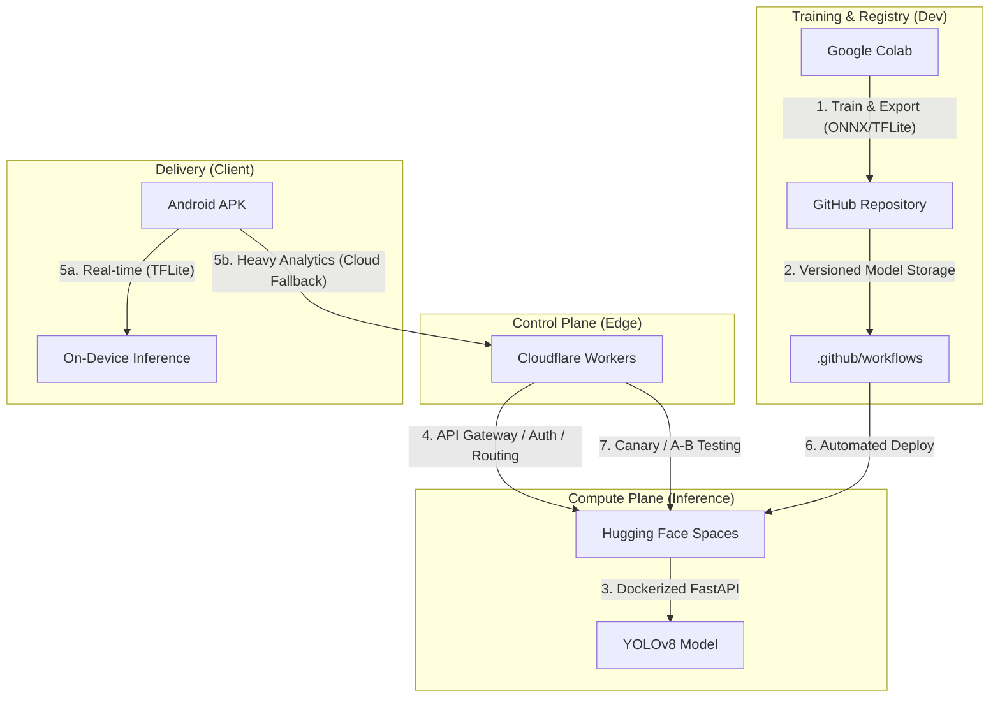

# Final Guide: Full-Cloud MLOps Architecture & Deployment

This document provides a comprehensive blueprint for shifting the `football-ml` project to a 100% cloud-based, production-grade MLOps workflow. It covers the architecture, data flows, and step-by-step instructions for connecting all services.

---

## 🏗 1. Architecture Diagram

The following diagram illustrates the "Control Plane vs. Compute Plane" architecture, showing how data and models flow between services.

---

## 🔄 2. System Flows & Connections

### A. The Training Flow (Colab -> GitHub)
1. **Compute**: Use Google Colab's free GPU to train the YOLOv8 model on the SoccerNet dataset.
2. **Artifacts**: Export the trained model into two formats:
   - **ONNX**: Optimized for cloud inference (FastAPI).
   - **TFLite**: Optimized for mobile inference (Android).
3. **Registry**: Push these files to your GitHub repository under `ml/models/vX.Y.Z/`.

### B. The Deployment Flow (GitHub -> Hugging Face)
1. **Automation**: GitHub Actions detects a push to the `backend/` or `ml/models/` directories.
2. **Containerization**: A Docker image is built using the `backend/Dockerfile`.
3. **Hosting**: The image is deployed to Hugging Face Spaces, which provides a public URL for the FastAPI inference service.

### C. The Security Flow (Cloudflare -> Backend)
1. **Gateway**: All mobile requests go through a Cloudflare Worker.
2. **Auth**: The Worker checks for a valid `x-api-key`.
3. **Routing**: The Worker forwards the request to the Hugging Face Space.
4. **Governance**: Cloudflare manages rate limiting and traffic splitting (Canary/A-B testing).

---

## 🛠 3. Step-by-Step Connection Guide

### Step 1: Connect GitHub to Google Colab
- Mount your Google Drive in Colab to save training checkpoints.
- Use `git` commands within Colab to push exported models directly to your repository.

### Step 2: Connect GitHub to Hugging Face
- In Hugging Face Spaces, create a new Space and select "Docker".
- Link your GitHub repository and set the Docker context to `backend/`.
- Set the `MODEL_PATH` environment variable to point to your latest ONNX model.

### Step 3: Connect Hugging Face to Cloudflare
- Copy your Hugging Face Space URL.
- In your Cloudflare Worker configuration, set the `BACKEND_URL` environment variable to this URL.
- Generate a secure `API_KEY` and add it to the Cloudflare Worker variables.

### Step 4: Connect Cloudflare to Android APK
- In your Android code (`Constants.kt`), set `CLOUDFLARE_URL` to your Worker's URL.
- Set the `API_KEY` to match the one in Cloudflare.
- Ensure the `model.tflite` is placed in the `assets/` folder for local inference.

---

## 💰 4. "Free Forever" Service Summary

| Service | Free Tier Benefit | Usage in Football-ML |
| :--- | :--- | :--- |
| **GitHub** | Unlimited Public Repos + 2k Actions mins | Code hosting, Model Registry, CI/CD. |
| **Google Colab** | Free T4/L4 GPU Access | High-speed YOLOv8 training. |
| **Hugging Face** | Free CPU Spaces (16GB RAM) | Dockerized FastAPI inference hosting. |
| **Cloudflare** | 100,000 requests/day | Edge security, API Gateway, Routing. |

---

## 🏁 5. Final Checklist for Production
- [ ] Models exported and versioned in GitHub.
- [ ] FastAPI backend healthy on Hugging Face.
- [ ] Cloudflare Worker deployed with API Key.
- [ ] Android APK configured with Cloudflare URL.
- [ ] CI/CD pipeline green and passing tests.
